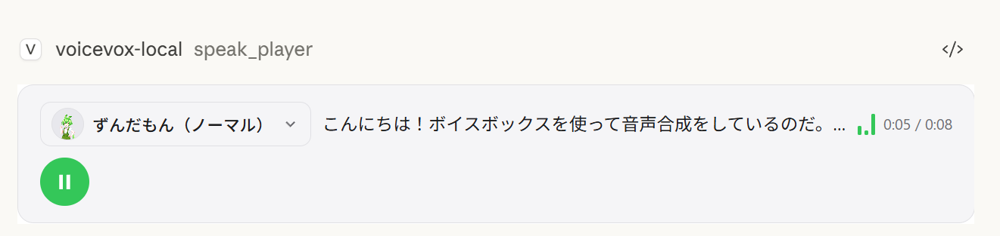
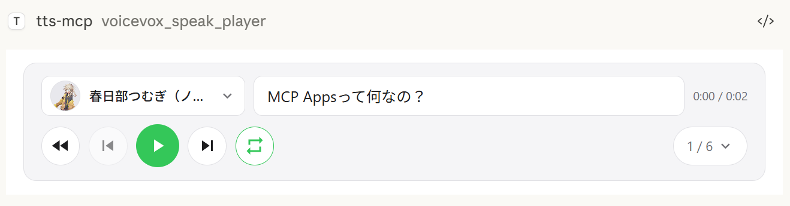
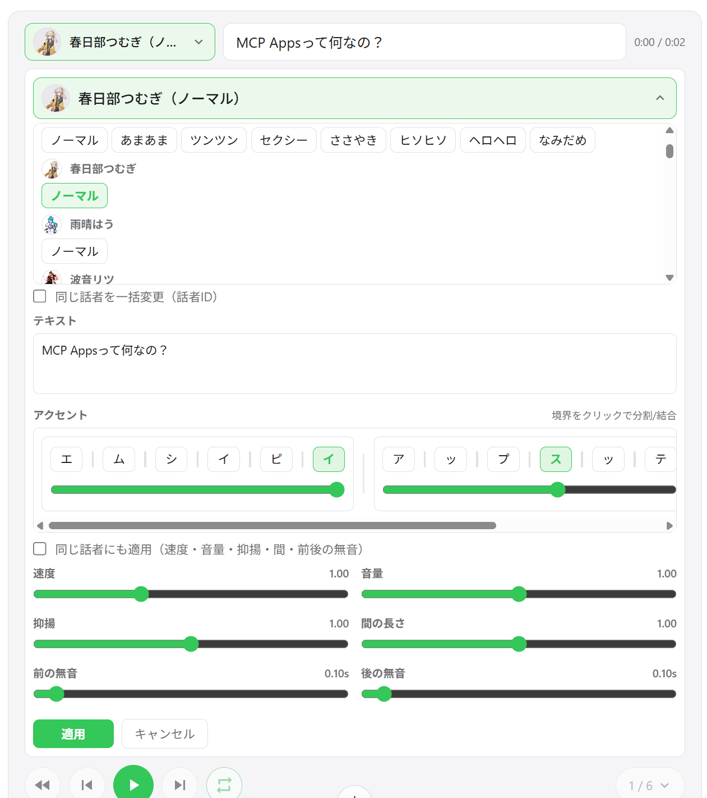

# VOICEVOX TTS MCP

[English](README.md) | **日本語**

VOICEVOX を使用した MCP テキスト読み上げサーバー

> 🎮 **[ブラウザデモを試す](https://kajidog.github.io/mcp-tts-voicevox/)** — VoicevoxClient をブラウザで直接テスト

## 何ができるか

- **AI アシスタントに喋らせる** — Claude Desktop などの MCP クライアントからテキストを読み上げ
- **UI オーディオプレーヤー（MCP Apps）** — チャット内で直接音声を再生できるインタラクティブプレーヤー
- **複数キャラクターの会話** — 1 回の呼び出しでセグメントごとに話者を切り替え可能
- **スムーズな再生** — キュー管理、即時再生、先読み、ストリーミング再生
- **クロスプラットフォーム** — Windows, macOS, Linux（WSL 含む）で動作

## UI オーディオプレーヤー（MCP Apps）



`speak_player` ツールは [MCP Apps](https://github.com/modelcontextprotocol/ext-apps) を使用して、チャット内にインタラクティブなオーディオプレーヤーを表示します。通常の `speak` ツールがサーバー側で音声を再生するのに対し、**音声はクライアント側（ブラウザ/アプリ内）で再生されます** — サーバーに音声デバイスは不要です。

### 特徴

- **クライアント側再生** — 音声はサーバーではなく Claude Desktop のチャット内で再生。リモート接続でも動作します。
- **再生コントロール** — 再生/一時停止などの操作が会話内に埋め込まれます
- **マルチスピーカー対話** — 複数話者の会話を1つのプレーヤーでトラック切り替えしながら順次再生
- **スピーカー変更** — プレーヤー UI から直接、任意のセグメントの声を変更可能

| マルチスピーカー再生 | トラックリスト | スピーカー変更 |
|:---:|:---:|:---:|
|  |  |  |

> **注意:** `speak_player` は MCP Apps 対応ホスト（Claude Desktop など）が必要です。MCP Apps 非対応のホストでは利用できないため、代わりに `speak`（サーバー側再生）を使用してください。

## クイックスタート

### 必要なもの

- Node.js 18.0.0 以上（または Bun）**または Docker**
- [VOICEVOX Engine](https://voicevox.hiroshiba.jp/)（起動しておく。Docker Compose に含まれています）
- ffplay（任意・推奨。Docker の場合は不要）

#### FFplay の導入

ffplay は FFmpeg に同梱される小型プレイヤーで、標準入力からの再生に対応します。導入済みの環境では、低遅延で安定したストリーミング再生を自動的に使用します。

> 💡 **ffplay がなくても動作します。** その場合は一時ファイル経由の再生（Windows: PowerShell、macOS: afplay、Linux: aplay 等）にフォールバックします。

- 導入は簡単: 各 OS でワンライナーのセットアップ（下記手順）
- 必須事項: `ffplay` に PATH が通っている必要があります（導入後に端末/アプリ再起動）

<details>
<summary>FFplay の導入手順と PATH 反映</summary>

インストール例:

- Windows（いずれか）
  - Winget: `winget install --id=Gyan.FFmpeg -e`
  - Chocolatey: `choco install ffmpeg`
  - Scoop: `scoop install ffmpeg`
  - 公式ビルド（例）: https://www.gyan.dev/ffmpeg/builds/ または https://github.com/BtbN/FFmpeg-Builds から zip を取得し、`bin` フォルダを PATH に追加

- macOS
  - Homebrew: `brew install ffmpeg`

- Linux
  - Debian/Ubuntu: `sudo apt-get update && sudo apt-get install -y ffmpeg`
  - Fedora: `sudo dnf install -y ffmpeg`
  - Arch: `sudo pacman -S ffmpeg`

PATH の反映:

- Windows: 環境変数に `...\ffmpeg\bin` を追加後、PowerShell/端末・エディタ（Claude/VS Code 等）を再起動。
  - 反映確認: `powershell -c "$env:Path"` に ffmpeg のパスが含まれること
- macOS/Linux: 通常は自動反映。必要に応じて `echo $PATH` で確認し、シェルを再起動。
- MCP クライアント（Claude Desktop/Code）: アプリ側のプロセス再起動で PATH を再読込します。

動作確認:

```bash
ffplay -version
```

バージョン情報が表示されれば導入完了です。CLI/MCP は自動的に ffplay を検出して標準入力ストリーミング再生を使用します。

</details>


### 3 ステップで開始

**1. VOICEVOX Engine を起動**

**2. Claude Desktop の設定ファイルに追加**

設定ファイルの場所:
- Windows: `%APPDATA%\Claude\claude_desktop_config.json`
- macOS: `~/Library/Application Support/Claude/claude_desktop_config.json`

```json
{
  "mcpServers": {
    "tts-mcp": {
      "command": "npx",
      "args": ["-y", "@kajidog/mcp-tts-voicevox"]
    }
  }
}
```

> 💡 Bun を使う場合は `npx` を `bunx` に置き換えるだけでOK:
> ```json
> "command": "bunx", "args": ["@kajidog/mcp-tts-voicevox"]
> ```

**3. Claude Desktop を再起動**

これだけで Claude に「〇〇と喋って」と頼めば喋ってくれます！

### Docker でクイックスタート

Docker Compose を使えば、MCP サーバーと VOICEVOX Engine をまとめて起動できます。Node.js や VOICEVOX のインストールは不要です。

**1. コンテナを起動**

```bash
docker compose up -d
```

VOICEVOX Engine と MCP サーバー（HTTP モード、ポート 3000）が起動します。

**2. Claude Desktop の設定ファイルに追加（mcp-remote 使用）**

```json
{
  "mcpServers": {
    "tts-mcp": {
      "command": "npx",
      "args": ["-y", "mcp-remote", "http://localhost:3000/mcp"]
    }
  }
}
```

**3. Claude Desktop を再起動**

> **制限事項（Docker）:** Docker コンテナには音声デバイスがないため、`speak` ツール（サーバー側再生）はデフォルトで無効化されています。代わりに `speak_player` を使用してください。`speak_player` はクライアント側（Claude Desktop 内）で音声を再生するため、サーバーに音声デバイスがなくても動作します。詳細は [UI オーディオプレーヤー](#ui-オーディオプレーヤーmcp-apps) をご覧ください。

---

## MCP ツール

### `speak` — テキスト読み上げ

Claude から呼び出せるメインの機能です。

| パラメータ | 説明 | デフォルト |
|-----------|------|-----------|
| `text` | 読み上げるテキスト（改行で複数セグメント） | 必須 |
| `speaker` | 話者 ID | 1 |
| `speedScale` | 再生速度 | 1.0 |
| `immediate` | 即時再生（キューをクリア） | true |
| `waitForEnd` | 再生完了まで待機 | false |

**使用例：**

```javascript
// シンプルなテキスト
{ "text": "こんにちは" }

// 話者を指定
{ "text": "こんにちは", "speaker": 3 }

// セグメントごとに話者を変更
{ "text": "1:こんにちは\n3:今日はいい天気ですね" }

// 再生完了まで待機（同期処理）
{ "text": "このメッセージを読み終えてから次へ", "waitForEnd": true }
```

<details>
<summary>その他のツール</summary>

| ツール | 説明 |
|--------|------|
| `speak_player` | UI 音声プレイヤー付き読み上げ（`--disable-tools` で無効化可） |
| `ping_voicevox` | VOICEVOX Engine への接続確認 |
| `get_speakers` | 利用可能な話者一覧を取得 |
| `stop_speaker` | 再生停止とキューのクリア |
| `synthesize_file` | 音声ファイルを生成 |

</details>

---

## 設定

<details>
<summary><b>環境変数で設定</b></summary>

### VOICEVOX 設定

| 環境変数 | 説明 | デフォルト |
|---------|------|-----------|
| `VOICEVOX_URL` | Engine の URL | `http://localhost:50021` |
| `VOICEVOX_DEFAULT_SPEAKER` | デフォルト話者 ID | `1` |
| `VOICEVOX_DEFAULT_SPEED_SCALE` | 再生速度 | `1.0` |

### 再生オプション

| 環境変数 | 説明 | デフォルト |
|---------|------|-----------|
| `VOICEVOX_USE_STREAMING` | ストリーミング再生（`ffplay` 必要） | `false` |
| `VOICEVOX_DEFAULT_IMMEDIATE` | 即時再生 | `true` |
| `VOICEVOX_DEFAULT_WAIT_FOR_START` | 再生開始まで待機 | `false` |
| `VOICEVOX_DEFAULT_WAIT_FOR_END` | 再生完了まで待機 | `false` |

### 制限設定

AI が特定のオプションを指定できないように制限できます。

| 環境変数 | 説明 |
|---------|------|
| `VOICEVOX_RESTRICT_IMMEDIATE` | `immediate` オプションを制限 |
| `VOICEVOX_RESTRICT_WAIT_FOR_START` | `waitForStart` オプションを制限 |
| `VOICEVOX_RESTRICT_WAIT_FOR_END` | `waitForEnd` オプションを制限 |

### ツールの無効化

```bash
# 不要なツールを無効化
export VOICEVOX_DISABLED_TOOLS=speak_player,synthesize_file
```

### UI プレイヤー設定

| 環境変数 | 説明 | デフォルト |
|---------|------|-----------|
| `VOICEVOX_AUTO_PLAY` | UI プレイヤーで自動再生 | `true` |

### サーバー設定

| 環境変数 | 説明 | デフォルト |
|---------|------|-----------|
| `MCP_HTTP_MODE` | HTTP モードを有効化 | `false` |
| `MCP_HTTP_PORT` | HTTP ポート | `3000` |
| `MCP_HTTP_HOST` | HTTP ホスト | `0.0.0.0` |
| `MCP_ALLOWED_HOSTS` | 許可するホスト（カンマ区切り） | `localhost,127.0.0.1,[::1]` |
| `MCP_ALLOWED_ORIGINS` | 許可するオリジン（カンマ区切り） | `http://localhost,http://127.0.0.1,...` |

</details>

<details>
<summary><b>コマンドライン引数で設定</b></summary>

コマンドライン引数は環境変数より優先されます。

```bash
# 基本設定
npx @kajidog/mcp-tts-voicevox --url http://192.168.1.100:50021 --speaker 3 --speed 1.2

# HTTP モード
npx @kajidog/mcp-tts-voicevox --http --port 8080

# 制限付き
npx @kajidog/mcp-tts-voicevox --restrict-immediate --restrict-wait-for-end

# ツール無効化
npx @kajidog/mcp-tts-voicevox --disable-tools speak_player,synthesize_file
```

| 引数 | 説明 |
|------|------|
| `--help`, `-h` | ヘルプを表示 |
| `--version`, `-v` | バージョンを表示 |
| `--url <value>` | VOICEVOX Engine URL |
| `--speaker <value>` | デフォルト話者 ID |
| `--speed <value>` | 再生速度 |
| `--use-streaming` / `--no-use-streaming` | ストリーミング再生 |
| `--immediate` / `--no-immediate` | 即時再生 |
| `--wait-for-start` / `--no-wait-for-start` | 再生開始待機 |
| `--wait-for-end` / `--no-wait-for-end` | 再生完了待機 |
| `--restrict-immediate` | immediate を制限 |
| `--restrict-wait-for-start` | waitForStart を制限 |
| `--restrict-wait-for-end` | waitForEnd を制限 |
| `--disable-tools <tools>` | ツールを無効化 |
| `--auto-play` / `--no-auto-play` | UI プレイヤーで自動再生 |
| `--http` | HTTP モード |
| `--port <value>` | HTTP ポート |
| `--host <value>` | HTTP ホスト |
| `--allowed-hosts <hosts>` | 許可するホスト（カンマ区切り） |
| `--allowed-origins <origins>` | 許可するオリジン（カンマ区切り） |

</details>

<details>
<summary><b>HTTP モードで使う</b></summary>

リモート接続が必要な場合：

**サーバー起動：**

```bash
# Linux/macOS
MCP_HTTP_MODE=true MCP_HTTP_PORT=3000 npx @kajidog/mcp-tts-voicevox

# Windows PowerShell
$env:MCP_HTTP_MODE='true'; $env:MCP_HTTP_PORT='3000'; npx @kajidog/mcp-tts-voicevox
```

**Claude Desktop 設定（mcp-remote 使用）：**

```json
{
  "mcpServers": {
    "tts-mcp-proxy": {
      "command": "npx",
      "args": ["-y", "mcp-remote", "http://localhost:3000/mcp"]
    }
  }
}
```

### プロジェクトごとの話者設定

Claude Code では `.mcp.json` にカスタムヘッダーを設定することで、プロジェクトごとに異なるデフォルト話者を設定できます：

| ヘッダー | 説明 |
|---------|------|
| `X-Voicevox-Speaker` | このプロジェクトのデフォルト話者 ID |

**`.mcp.json` の例：**

```json
{
  "mcpServers": {
    "tts": {
      "type": "http",
      "url": "http://localhost:3000/mcp",
      "headers": {
        "X-Voicevox-Speaker": "113"
      }
    }
  }
}
```

これにより、プロジェクトごとに自動的に異なる音声キャラクターを使い分けることができます。

**優先順位：**
1. ツール呼び出し時の `speaker` パラメータ（最高）
2. `X-Voicevox-Speaker` ヘッダーによるプロジェクトデフォルト
3. グローバルな `VOICEVOX_DEFAULT_SPEAKER` 設定（最低）

</details>

<details>
<summary><b>WSL から Windows ホストに接続</b></summary>

WSL 内から Windows で動作する MCP サーバーに接続する場合：

### 1. WSL 側で Windows ホストの IP を確認

```bash
# 方法1: デフォルトゲートウェイから取得
ip route show | grep -oP 'default via \K[\d.]+'
# 通常 172.x.x.1 の形式

# 方法2: /etc/resolv.conf から取得（WSL2）
cat /etc/resolv.conf | grep nameserver | awk '{print $2}'
```

### 2. Windows 側でサーバー起動

WSL からのアクセスを許可するため、`MCP_ALLOWED_HOSTS` に WSL ゲートウェイ IP を追加：

```powershell
$env:MCP_HTTP_MODE='true'
$env:MCP_ALLOWED_HOSTS='localhost,127.0.0.1,172.29.176.1'
npx @kajidog/mcp-tts-voicevox
```

または CLI 引数で：

```powershell
npx @kajidog/mcp-tts-voicevox --http --allowed-hosts "localhost,127.0.0.1,172.29.176.1"
```

### 3. WSL 側の設定（.mcp.json）

```json
{
  "mcpServers": {
    "tts": {
      "type": "http",
      "url": "http://172.29.176.1:3000/mcp"
    }
  }
}
```

> ⚠️ WSL 内では `localhost` は WSL 自身を指すため、Windows ホストには WSL ゲートウェイ IP でアクセスします。

</details>

---

## トラブルシューティング

<details>
<summary><b>音声が再生されない</b></summary>

**1. VOICEVOX Engine が起動しているか確認**

```bash
curl http://localhost:50021/speakers
```

**2. プラットフォーム別の再生ツールを確認**

| OS | 必要なツール |
|----|------------|
| Linux | `aplay`, `paplay`, `play`, `ffplay` のいずれか |
| macOS | `afplay`（プリインストール済み） |
| Windows | PowerShell（プリインストール済み） |

</details>

<details>
<summary><b>MCP クライアントに認識されない</b></summary>

- パッケージのインストール確認：`npm list -g @kajidog/mcp-tts-voicevox`
- 設定ファイルの JSON 構文をチェック
- クライアントを再起動

</details>

---

## パッケージ構成

| パッケージ | 説明 |
|-----------|------|
| `@kajidog/mcp-tts-voicevox` | MCP サーバー本体 |
| [`@kajidog/voicevox-client`](https://www.npmjs.com/package/@kajidog/voicevox-client) | 汎用 VOICEVOX クライアントライブラリ（独立使用可能） |
| `@kajidog/player-ui` | ブラウザ再生用の React 音声プレイヤー UI |

---

<details>
<summary><b>開発者向け情報</b></summary>

### セットアップ

```bash
git clone https://github.com/kajidog/mcp-tts-voicevox.git
cd mcp-tts-voicevox
pnpm install
```

### コマンド

| コマンド | 説明 |
|---------|------|
| `pnpm build` | 全パッケージをビルド |
| `pnpm test` | テスト実行 |
| `pnpm lint` | Lint 実行 |
| `pnpm dev` | 開発サーバー起動 |
| `pnpm dev:stdio` | Stdio モードで開発 |
| `pnpm dev:bun` | Bun で開発サーバー起動 |
| `pnpm dev:bun:http` | Bun で HTTP 開発サーバー起動 |

</details>

---

## ライセンス

ISC
