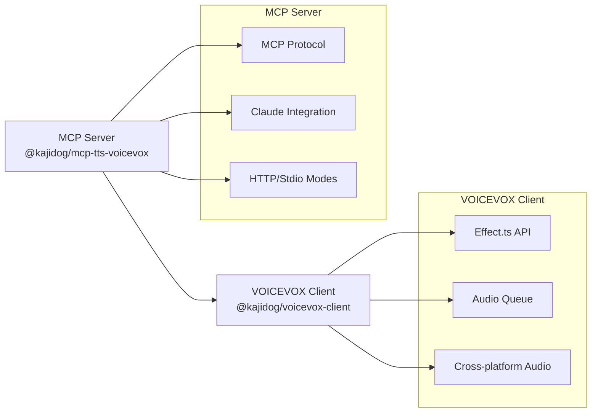

# MCP TTS VOICEVOX

VOICEVOX を使用した音声合成 MCP サーバー。

## 何ができるか

AI との会話から直接、自然な日本語音声を生成：

- AI アシスタント統合 - Claude Desktop の会話に音声出力を追加
- コンテンツ制作 - プレゼンテーション、チュートリアル、動画用の音声生成
- アクセシビリティ - 視覚的アクセシビリティのためのテキスト読み上げ
- 開発学習 - TypeScript アーキテクチャパターンの学習
- カスタムアプリケーション - 独立ライブラリで音声対応アプリを構築

## 主な特徴

### 高度な音声処理
- スマートキュー管理 - 自動音声プリフェッチとスムーズな再生
- 柔軟な再生制御 - 即時再生、同期待機、手動制御
- クロスプラットフォーム音声 - Windows、macOS、Linux でのネイティブ音声再生

### アーキテクチャ
- Effect.ts API 設計 - 関数型エラーハンドリング
- シンプルな分離 - MCP サーバーと VOICEVOX クライアントの分離
- 型安全性 - TypeScript による構造化エラーハンドリング

### 開発者体験
- 複数のトランスポートモード - Claude Desktop 用 Stdio、Claude Code 用 HTTP
- 環境の柔軟性 - WSL、コンテナ、様々な Node.js 環境で動作
- 外部依存関係ゼロ - OS 組み込みツールを使用した音声再生

## アーキテクチャ概要

2つのパッケージに分離した構成：



### 技術スタック

TypeScript、Effect.ts、Zod を使用。

## クイックスタート

### 1. インストール
```bash
npm install -g @kajidog/mcp-tts-voicevox
```

### 2. VOICEVOX エンジンを起動
[VOICEVOX エンジン](https://voicevox.hiroshiba.jp/)をダウンロードして `http://localhost:50021` で起動

### 3. 統合方法を選択

#### Claude Desktop の場合（Stdio）
`claude_desktop_config.json` に追加：
```json
{
  "mcpServers": {
    "tts": {
      "command": "npx",
      "args": ["-y", "@kajidog/mcp-tts-voicevox"]
    }
  }
}
```

#### Claude Code の場合（HTTP）
```bash
# HTTP サーバーを起動
MCP_HTTP_MODE=true npx @kajidog/mcp-tts-voicevox

# Claude Code に追加
claude mcp add --transport http tts http://127.0.0.1:3000/mcp
```

## 主要機能

### MCP ツール
- `speak` - 高度な再生オプション付きテキスト読み上げ
- `synthesize_file` - 後で使用する音声ファイル生成
- `stop_speaker` - 再生停止とキュークリア
- `get_speakers` - 利用可能な VOICEVOX 話者一覧

### 高度な再生例
```javascript
// 基本的な使用法
{ "text": "こんにちは世界" }

// 複数話者
{ "text": "1:こんにちは\n3:はじめまして" }

// 即時優先再生
{ "text": "緊急メッセージ", "immediate": true, "waitForEnd": true }

// 同期処理
{ "text": "完了まで待機", "waitForEnd": true }
```

## ドキュメント

- [詳細セットアップガイド](docs/SETUP.md) - 完全なインストールと設定
- [API リファレンス](docs/API.md) - 全 MCP ツールとパラメータ
- [アーキテクチャ](docs/ARCHITECTURE.md) - 技術実装の詳細
- [開発ガイド](docs/DEVELOPMENT.md) - 貢献とローカル開発

## パッケージ構成

### @kajidog/mcp-tts-voicevox（このパッケージ）
- 目的: MCP サーバー実装のみ
- 範囲: Claude Desktop/Code 統合
- 依存関係: `@kajidog/voicevox-client` を外部使用

### [@kajidog/voicevox-client](https://www.npmjs.com/package/@kajidog/voicevox-client)
- 目的: スタンドアロン VOICEVOX ライブラリ
- 範囲: 任意の Node.js アプリケーション
- API: Effect.ts
- 機能: キュー管理付き完全音声パイプライン

この分離により、開発者は適切なツールを選択可能：
- MCP サーバー使用 → AI アシスタント統合用
- クライアントライブラリ使用 → カスタムアプリケーション用

## 環境設定

```bash
# VOICEVOX エンジン設定
VOICEVOX_URL=http://localhost:50021
VOICEVOX_DEFAULT_SPEAKER=1

# 再生動作
VOICEVOX_DEFAULT_IMMEDIATE=true
VOICEVOX_DEFAULT_WAIT_FOR_END=false

# サーバーモード
MCP_HTTP_MODE=true
MCP_HTTP_PORT=3000
```

## ライセンス

ISC

[](https://mseep.ai/app/kajidog-mcp-tts-voicevox)
