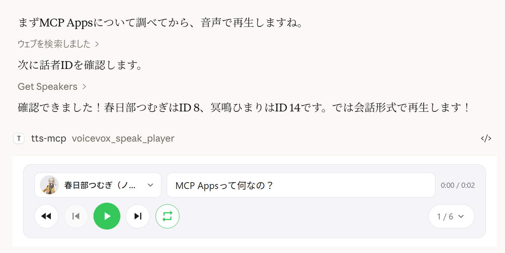
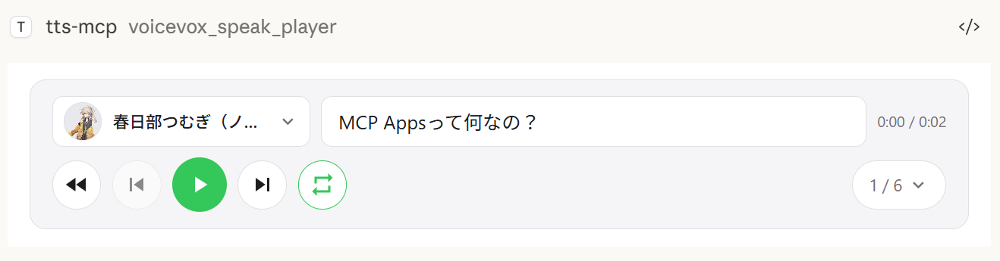
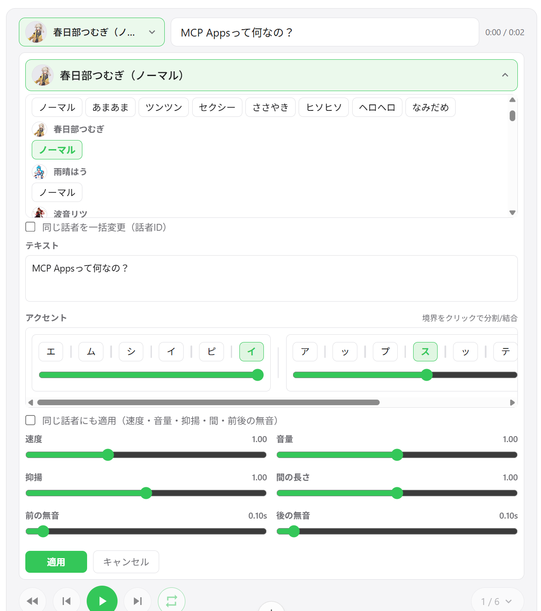
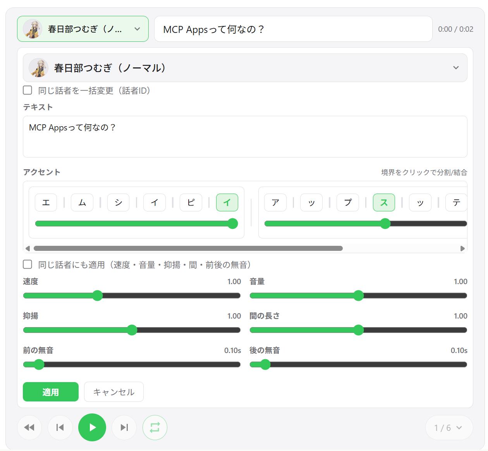
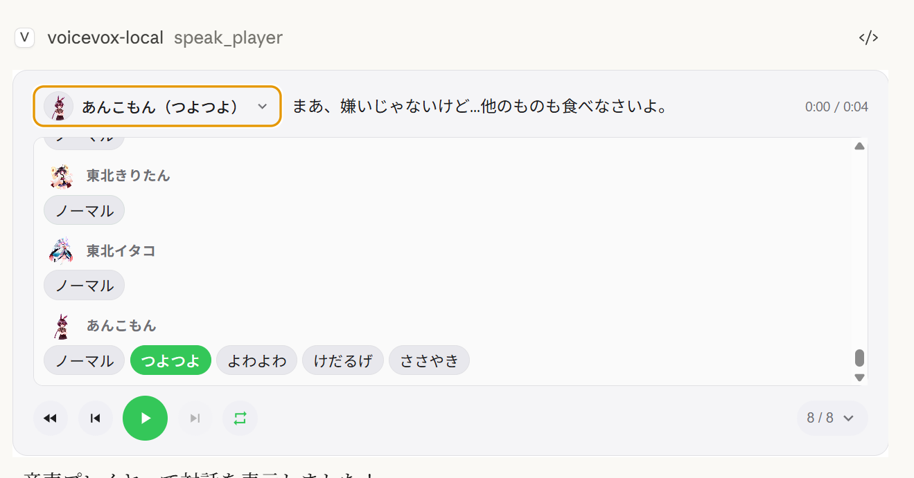
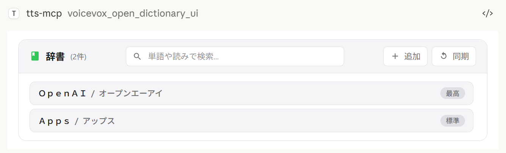
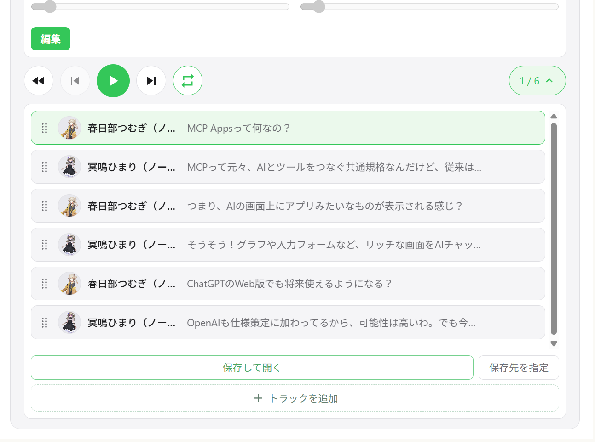

# VOICEVOX TTS MCP

**English** | [日本語](README.ja.md)

A text-to-speech MCP server using VOICEVOX

> 🎮 **[Try the Browser Demo](https://kajidog.github.io/mcp-tts-voicevox/)** — Test VoicevoxClient directly in your browser

## What You Can Do

- **Make your AI assistant speak** — Text-to-speech from MCP clients like Claude Desktop
- **UI Audio Player (MCP Apps)** — Play audio directly in the chat with an interactive player (ChatGPT / Claude Desktop / Claude Web etc.)
- **Multi-character conversations** — Switch speakers per segment in a single call
- **Smooth playback** — Queue management, immediate playback, prefetching, streaming
- **Cross-platform** — Works on Windows, macOS, Linux (including WSL)

## UI Audio Player (MCP Apps)



The `voicevox_speak_player` tool uses [MCP Apps](https://github.com/modelcontextprotocol/ext-apps) to render an interactive audio player directly inside the chat. Unlike the standard `voicevox_speak` tool which plays audio on the server, **audio is played on the client side (in the browser/app)** — no audio device needed on the server.

### Features

- **Client-side playback** — Audio plays in Claude Desktop's chat, not on the server. Works even over remote connections.
- **Play/Pause controls** — Full playback controls embedded in the conversation
- **Multi-speaker dialogue** — Sequential playback of multiple speakers in one player with track navigation
- **Speaker switching** — Change the voice of any segment directly from the player UI
- **Segment editing** — Adjust speed, volume, intonation, pause length, and pre/post silence per segment
- **Accent phrase editing** — Edit accent positions and mora pitch directly in the UI
- **Add / delete / reorder segments** — Drag-and-drop track reordering; add new segments inline
- **WAV export** — Save all tracks as numbered WAV files and open the output folder automatically
- **User dictionary manager** — Add, edit, and delete VOICEVOX user dictionary words with preview playback
- **Cross-session state restore** — Player state is persisted on the server; reopening the chat restores previous tracks

Export behavior by environment:
- `Save and open` always exports WAV files. If opening the file explorer is not supported, export still succeeds and the save path is shown in the UI.
- `Choose output folder` uses a native directory picker on Windows/macOS. On unsupported environments, this action falls back to the default export directory.

| Multi-speaker playback | Track list | Segment editing |
|:---:|:---:|:---:|
|  |  |  |

| Speaker selection | Dictionary manager | WAV export |
|:---:|:---:|:---:|
|  |  |  |

### Supported Clients

| Client | Connection | Notes |
|--------|-----------|-------|
| **ChatGPT** | HTTP (remote) | Requires `VOICEVOX_PLAYER_DOMAIN` |
| **Claude Desktop** | stdio (local) | Works out of the box |
| **Claude Desktop** | HTTP (via mcp-remote) | Do not set `VOICEVOX_PLAYER_DOMAIN` |

> **Note:** `speak_player` requires a host that supports MCP Apps. In hosts without MCP Apps support, the tool is not available and `speak` (server-side playback) can be used instead.

### Player MCP Tools

| Tool | Description |
|------|-------------|
| `speak_player` | Create a new player session and display the UI. Returns `viewUUID`. |
| `resynthesize_player` | Update all segments for an existing player (new `viewUUID` each call). |
| `get_player_state` | Read the current player state (paginated) for AI tuning. |
| `open_dictionary_ui` | Open the user dictionary manager UI. |

## Quick Start

### Requirements

- Node.js 18.0.0 or higher (or [Bun](https://bun.sh/)) **or Docker**
- [VOICEVOX Engine](https://voicevox.hiroshiba.jp/) (must be running; included in Docker Compose)
- ffplay (optional, recommended — not needed with Docker)

#### Installing FFplay

ffplay is a lightweight player included with FFmpeg that supports playback from stdin. When available, it automatically enables low-latency streaming playback.

> 💡 **FFplay is optional.** Without it, playback falls back to temp file-based playback (Windows: PowerShell, macOS: afplay, Linux: aplay, etc.).

- Easy setup: One-liner installation for each OS (see steps below)
- Required: `ffplay` must be in PATH (restart terminal/apps after installation)

<details>
<summary>FFplay Installation and PATH Setup</summary>

Installation examples:

- Windows (any of these)
  - Winget: `winget install --id=Gyan.FFmpeg -e`
  - Chocolatey: `choco install ffmpeg`
  - Scoop: `scoop install ffmpeg`
  - Official builds: Download from https://www.gyan.dev/ffmpeg/builds/ or https://github.com/BtbN/FFmpeg-Builds and add the `bin` folder to PATH

- macOS
  - Homebrew: `brew install ffmpeg`

- Linux
  - Debian/Ubuntu: `sudo apt-get update && sudo apt-get install -y ffmpeg`
  - Fedora: `sudo dnf install -y ffmpeg`
  - Arch: `sudo pacman -S ffmpeg`

PATH Setup:

- Windows: Add `...\ffmpeg\bin` to environment variables, then restart PowerShell/terminal and editor (Claude/VS Code, etc.)
  - Verify: `powershell -c "$env:Path"` should include the ffmpeg path
- macOS/Linux: Usually auto-detected. Check with `echo $PATH` if needed, restart shell.
- MCP clients (Claude Desktop/Code): Restart the app to reload PATH.

Verification:

```bash
ffplay -version
```

If version info is displayed, installation is complete. CLI/MCP will automatically detect ffplay and use stdin streaming playback.

</details>


### 3 Steps to Get Started

**1. Start VOICEVOX Engine**

**2. Add to Claude Desktop config file**

Config file location:
- Windows: `%APPDATA%\Claude\claude_desktop_config.json`
- macOS: `~/Library/Application Support/Claude/claude_desktop_config.json`

```json
{
  "mcpServers": {
    "tts-mcp": {
      "command": "npx",
      "args": ["-y", "@kajidog/mcp-tts-voicevox"]
    }
  }
}
```

> 💡 **If using Bun**, just replace `npx` with `bunx`:
> ```json
> "command": "bunx", "args": ["@kajidog/mcp-tts-voicevox"]
> ```

**3. Restart Claude Desktop**

That's it! Ask Claude to "say hello" and it will speak!

### Quick Start with Docker

You can run both the MCP server and VOICEVOX Engine with a single command using Docker Compose. No Node.js or VOICEVOX installation required.

**1. Start the containers**

```bash
docker compose up -d
```

This starts the VOICEVOX Engine and the MCP server (HTTP mode on port 3000).

**2. Add to Claude Desktop config file (using mcp-remote)**

```json
{
  "mcpServers": {
    "tts-mcp": {
      "command": "npx",
      "args": ["-y", "mcp-remote", "http://localhost:3000/mcp"]
    }
  }
}
```

**3. Restart Claude Desktop**

> **Limitations (Docker):** The Docker container has no audio device, so the `voicevox_speak` tool (server-side playback) is disabled by default. Use `voicevox_speak_player` instead — it plays audio on the client side (in Claude Desktop) and works without any audio device on the server. See [UI Audio Player](#ui-audio-player-mcp-apps) for details.

---

## MCP Tools

### `voicevox_speak` — Text-to-Speech

The main feature callable from Claude.

| Parameter | Description | Default |
|-----------|-------------|---------|
| `text` | Text to speak (multiple segments separated by newlines) | Required |
| `speaker` | Speaker ID | 1 |
| `speedScale` | Playback speed | 1.0 |
| `immediate` | Immediate playback (clears queue) | true |
| `waitForEnd` | Wait for playback completion | false |

**Examples:**

```javascript
// Simple text
{ "text": "Hello" }

// Specify speaker
{ "text": "Hello", "speaker": 3 }

// Different speakers per segment
{ "text": "1:Hello\n3:Nice weather today" }

// Wait for completion (synchronous processing)
{ "text": "Wait for this to finish before continuing", "waitForEnd": true }
```

<details>
<summary>Other Tools</summary>

| Tool | Description |
|------|-------------|
| `voicevox_speak_player` | Speak with UI audio player (disable with `--disable-tools`) |
| `voicevox_ping` | Check VOICEVOX Engine connection |
| `voicevox_get_speakers` | Get list of available speakers |
| `voicevox_stop_speaker` | Stop playback and clear queue |
| `voicevox_synthesize_file` | Generate audio file |

</details>

---

## Configuration

<details>
<summary><b>Environment Variables</b></summary>

### VOICEVOX Settings

| Variable | Description | Default |
|----------|-------------|---------|
| `VOICEVOX_URL` | Engine URL | `http://localhost:50021` |
| `VOICEVOX_DEFAULT_SPEAKER` | Default speaker ID | `1` |
| `VOICEVOX_DEFAULT_SPEED_SCALE` | Playback speed | `1.0` |

### Playback Options

| Variable | Description | Default |
|----------|-------------|---------|
| `VOICEVOX_USE_STREAMING` | Streaming playback (requires `ffplay`) | `false` |
| `VOICEVOX_DEFAULT_IMMEDIATE` | Immediate playback | `true` |
| `VOICEVOX_DEFAULT_WAIT_FOR_START` | Wait for playback start | `false` |
| `VOICEVOX_DEFAULT_WAIT_FOR_END` | Wait for playback end | `false` |

### Restriction Settings

Restrict AI from specifying certain options.

| Variable | Description |
|----------|-------------|
| `VOICEVOX_RESTRICT_IMMEDIATE` | Restrict `immediate` option |
| `VOICEVOX_RESTRICT_WAIT_FOR_START` | Restrict `waitForStart` option |
| `VOICEVOX_RESTRICT_WAIT_FOR_END` | Restrict `waitForEnd` option |

### Disable Tools

```bash
# Disable individual tools
export VOICEVOX_DISABLED_TOOLS=speak_player,synthesize_file

# Disable a built-in group of tools
export VOICEVOX_DISABLED_GROUPS=player

# Combine groups and individual tools
export VOICEVOX_DISABLED_GROUPS=dictionary
export VOICEVOX_DISABLED_TOOLS=synthesize_file
```

Built-in groups for `VOICEVOX_DISABLED_GROUPS` / `--disable-groups`:

| Group | Tools |
|-------|-------|
| `player` | `speak_player`, `resynthesize_player`, `get_player_state`, `open_dictionary_ui` |
| `dictionary` | `get_accent_phrases`, `get_user_dictionary`, `add_user_dictionary_word`, `update_user_dictionary_word`, `delete_user_dictionary_word`, `add_user_dictionary_words`, `update_user_dictionary_words` |
| `file` | `synthesize_file` |
| `apps` | `speak_player`, `resynthesize_player`, `open_dictionary_ui` (MCP App UI tools) |

### UI Player Settings

| Variable | Description | Default |
|----------|-------------|---------|
| `VOICEVOX_PLAYER_DOMAIN` | Widget domain for UI player (required for ChatGPT, e.g. `https://your-app.onrender.com`) | _(unset)_ |
| `VOICEVOX_AUTO_PLAY` | Auto-play audio in UI player | `true` |
| `VOICEVOX_PLAYER_EXPORT_ENABLED` | Enable track export(download) from UI player (`false` to disable) | `true` |
| `VOICEVOX_PLAYER_EXPORT_DIR` | Default output directory for exported tracks (also used as fallback when folder picker is unavailable) | `./voicevox-player-exports` |
| `VOICEVOX_PLAYER_CACHE_DIR` | Directory for player cache files (`*.txt`) and default player state file | `./.voicevox-player-cache` |
| `VOICEVOX_PLAYER_AUDIO_CACHE_ENABLED` | Enable persistent audio cache on disk (`false` disables disk cache writes/reads) | `true` |
| `VOICEVOX_PLAYER_AUDIO_CACHE_TTL_DAYS` | Audio cache retention in days (`0`: disable disk cache, `-1`: no TTL cleanup) | `30` |
| `VOICEVOX_PLAYER_AUDIO_CACHE_MAX_MB` | Audio cache size cap in MB (`0`: disable disk cache, `-1`: unlimited) | `512` |
| `VOICEVOX_PLAYER_STATE_FILE` | Path of persisted player state JSON | `<VOICEVOX_PLAYER_CACHE_DIR>/player-state.json` |

### Server Settings

| Variable | Description | Default |
|----------|-------------|---------|
| `MCP_HTTP_MODE` | Enable HTTP mode | `false` |
| `MCP_HTTP_PORT` | HTTP port | `3000` |
| `MCP_HTTP_HOST` | HTTP host | `0.0.0.0` |
| `MCP_ALLOWED_HOSTS` | Allowed hosts (comma-separated) | `localhost,127.0.0.1,[::1]` |
| `MCP_ALLOWED_ORIGINS` | Allowed origins (comma-separated) | `http://localhost,http://127.0.0.1,...` |
| `MCP_API_KEY` | Required API key for `/mcp` (sent via `X-API-Key` or `Authorization: Bearer`) | _(unset)_ |

</details>

<details>
<summary><b>Command Line Arguments</b></summary>

Command line arguments take priority over environment variables.

```bash
# Basic settings
npx @kajidog/mcp-tts-voicevox --url http://192.168.1.100:50021 --speaker 3 --speed 1.2

# HTTP mode
npx @kajidog/mcp-tts-voicevox --http --port 8080

# With restrictions
npx @kajidog/mcp-tts-voicevox --restrict-immediate --restrict-wait-for-end

# Disable individual tools
npx @kajidog/mcp-tts-voicevox --disable-tools speak_player,synthesize_file

# Disable a tool group
npx @kajidog/mcp-tts-voicevox --disable-groups player
```

| Argument | Description |
|----------|-------------|
| `--help`, `-h` | Show help |
| `--version`, `-v` | Show version |
| `--init` | Generate `.voicevoxrc.json` with default settings |
| `--config <path>` | Path to config file |
| `--url <value>` | VOICEVOX Engine URL |
| `--speaker <value>` | Default speaker ID |
| `--speed <value>` | Playback speed |
| `--use-streaming` / `--no-use-streaming` | Streaming playback |
| `--immediate` / `--no-immediate` | Immediate playback |
| `--wait-for-start` / `--no-wait-for-start` | Wait for start |
| `--wait-for-end` / `--no-wait-for-end` | Wait for end |
| `--restrict-immediate` | Restrict immediate |
| `--restrict-wait-for-start` | Restrict waitForStart |
| `--restrict-wait-for-end` | Restrict waitForEnd |
| `--disable-tools <tools>` | Disable tools (comma-separated tool names) |
| `--disable-groups <groups>` | Disable tool groups: `player`, `dictionary`, `file`, `apps` |
| `--auto-play` / `--no-auto-play` | Auto-play in UI player |
| `--player-export` / `--no-player-export` | Enable/disable track export(download) in UI player |
| `--player-export-dir <dir>` | Default output directory for exported tracks |
| `--player-cache-dir <dir>` | Player cache directory |
| `--player-state-file <path>` | Persisted player state file path |
| `--player-audio-cache` / `--no-player-audio-cache` | Enable/disable disk audio cache for player |
| `--player-audio-cache-ttl-days <days>` | Audio cache retention days (`0`: disable, `-1`: no TTL cleanup) |
| `--player-audio-cache-max-mb <mb>` | Audio cache size cap in MB (`0`: disable, `-1`: unlimited) |
| `--http` | HTTP mode |
| `--port <value>` | HTTP port |
| `--host <value>` | HTTP host |
| `--allowed-hosts <hosts>` | Allowed hosts (comma-separated) |
| `--allowed-origins <origins>` | Allowed origins (comma-separated) |
| `--api-key <key>` | Required API key for `/mcp` |

</details>

<details>
<summary><b>Config File (.voicevoxrc.json)</b></summary>

You can use a JSON config file instead of (or in addition to) environment variables and CLI arguments. This is useful when you have many settings to configure.

**Priority order:** CLI args > Environment variables > Config file > Defaults

### Generate a config file

```bash
npx @kajidog/mcp-tts-voicevox --init
```

This creates `.voicevoxrc.json` in the current directory with all default settings. Edit it as needed.

### Use a custom config file path

```bash
npx @kajidog/mcp-tts-voicevox --config ./my-config.json
```

Or via environment variable:

```bash
VOICEVOX_CONFIG=./my-config.json npx @kajidog/mcp-tts-voicevox
```

### Example `.voicevoxrc.json`

```json
{
  "url": "http://192.168.1.50:50021",
  "speaker": 3,
  "speed": 1.2,
  "http": true,
  "port": 8080,
  "disable-tools": ["synthesize_file"],
  "disable-groups": ["dictionary"]
}
```

Keys can be written in kebab-case (`use-streaming`), camelCase (`useStreaming`), or internal key names (`defaultSpeaker`). If `.voicevoxrc.json` exists in the current directory, it is loaded automatically.

</details>

<details>
<summary><b>HTTP Mode</b></summary>

For remote connections:

**Start Server:**

```bash
# Linux/macOS
MCP_HTTP_MODE=true MCP_HTTP_PORT=3000 npx @kajidog/mcp-tts-voicevox

# Windows PowerShell
$env:MCP_HTTP_MODE='true'; $env:MCP_HTTP_PORT='3000'; npx @kajidog/mcp-tts-voicevox
```

**Claude Desktop Config (using mcp-remote):**

```json
{
  "mcpServers": {
    "tts-mcp-proxy": {
      "command": "npx",
      "args": ["-y", "mcp-remote", "http://localhost:3000/mcp"]
    }
  }
}
```

### Per-Project Speaker Settings

With Claude Code, you can configure different default speakers per project using custom headers in `.mcp.json`:

| Header | Description |
|--------|-------------|
| `X-Voicevox-Speaker` | Default speaker ID for this project |
| `X-API-Key` | API key when `MCP_API_KEY` is configured |

**Example `.mcp.json`:**

```json
{
  "mcpServers": {
    "tts": {
      "type": "http",
      "url": "http://localhost:3000/mcp",
      "headers": {
        "X-Voicevox-Speaker": "113",
        "X-API-Key": "your-api-key"
      }
    }
  }
}
```

This allows each project to use a different voice character automatically.

**Priority order:**
1. Explicit `speaker` parameter in tool call (highest)
2. Project default from `X-Voicevox-Speaker` header
3. Global `VOICEVOX_DEFAULT_SPEAKER` setting (lowest)

</details>

<details>
<summary><b>WSL to Windows Host Connection</b></summary>

Connecting from WSL to an MCP server running on Windows:

### 1. Get Windows Host IP from WSL

```bash
# Method 1: From default gateway
ip route show | grep -oP 'default via \K[\d.]+'
# Usually in the format 172.x.x.1

# Method 2: From /etc/resolv.conf (WSL2)
cat /etc/resolv.conf | grep nameserver | awk '{print $2}'
```

### 2. Start Server on Windows

Add the WSL gateway IP to `MCP_ALLOWED_HOSTS` to allow access from WSL:

```powershell
$env:MCP_HTTP_MODE='true'
$env:MCP_ALLOWED_HOSTS='localhost,127.0.0.1,172.29.176.1'
npx @kajidog/mcp-tts-voicevox
```

Or with CLI arguments:

```powershell
npx @kajidog/mcp-tts-voicevox --http --allowed-hosts "localhost,127.0.0.1,172.29.176.1"
```

### 3. WSL Configuration (.mcp.json)

```json
{
  "mcpServers": {
    "tts": {
      "type": "http",
      "url": "http://172.29.176.1:3000/mcp"
    }
  }
}
```

> ⚠️ Within WSL, `localhost` refers to WSL itself. Use the WSL gateway IP to access the Windows host.

</details>

<details>
<summary><b>Using with ChatGPT</b></summary>

To use with ChatGPT, deploy the MCP server in HTTP mode to the cloud with access to a VOICEVOX Engine.

### 1. Deploy to the Cloud

Deploy with Docker to Render, Railway, etc. (Dockerfile included).

### 2. Set Up VOICEVOX Engine

Run VOICEVOX Engine locally and expose it via ngrok, or deploy it alongside the MCP server.

### 3. Configure Environment Variables

| Variable | Example | Description |
|----------|---------|-------------|
| `VOICEVOX_URL` | `https://xxxx.ngrok-free.app` | VOICEVOX Engine URL |
| `MCP_HTTP_MODE` | `true` | Enable HTTP mode |
| `MCP_ALLOWED_HOSTS` | `your-app.onrender.com` | Deployed hostname |
| `VOICEVOX_PLAYER_DOMAIN` | `https://your-app.onrender.com` | Widget domain for UI player (required for ChatGPT) |
| `VOICEVOX_DISABLED_TOOLS` | `speak` | Disable server-side playback (no audio device) |
| `VOICEVOX_PLAYER_EXPORT_ENABLED` | `false` | Disable export feature (files cannot be downloaded from cloud) |

### 4. Add Connector in ChatGPT

Go to ChatGPT Settings → Connectors → Add MCP server URL (`https://your-app.onrender.com/mcp`).

</details>

<details>
<summary><b>Using with Claude Web</b></summary>

The basic steps are the same as ChatGPT, but the `VOICEVOX_PLAYER_DOMAIN` value is different.

Claude Web requires `ui.domain` to be a **hash-based dedicated domain**. Compute it with the following command:

```bash
node -e "console.log(require('crypto').createHash('sha256').update('Your MCP server URL').digest('hex').slice(0,32)+'.claudemcpcontent.com')"
```

Example: If your MCP server URL is `https://your-app.onrender.com/mcp`:

```bash
node -e "console.log(require('crypto').createHash('sha256').update('https://your-app.onrender.com/mcp').digest('hex').slice(0,32)+'.claudemcpcontent.com')"
# Example output: 48fb73a6...claudemcpcontent.com
```

Set this output value as `VOICEVOX_PLAYER_DOMAIN`.

> **Note**: Since ChatGPT and Claude Web require different `VOICEVOX_PLAYER_DOMAIN` values, a single instance cannot serve both clients simultaneously. Deploy separate instances for each, or switch the environment variable depending on your target client.

</details>

---

## Troubleshooting

<details>
<summary><b>Audio is not playing</b></summary>

**1. Check if VOICEVOX Engine is running**

```bash
curl http://localhost:50021/speakers
```

**2. Check platform-specific playback tools**

| OS | Required Tool |
|----|---------------|
| Linux | One of `aplay`, `paplay`, `play`, `ffplay` |
| macOS | `afplay` (pre-installed) |
| Windows | PowerShell (pre-installed) |

</details>

<details>
<summary><b>Not recognized by MCP client</b></summary>

- Check package installation: `npm list -g @kajidog/mcp-tts-voicevox`
- Verify JSON syntax in config file
- Restart the client

</details>

---

## Package Structure

| Package | Description |
|---------|-------------|
| `@kajidog/mcp-tts-voicevox` | MCP server |
| [`@kajidog/voicevox-client`](https://www.npmjs.com/package/@kajidog/voicevox-client) | General-purpose VOICEVOX client library (can be used independently) |
| `@kajidog/player-ui` | React-based audio player UI for browser playback |

---

<details>
<summary><b>Developer Information</b></summary>

### Setup

```bash
git clone https://github.com/kajidog/mcp-tts-voicevox.git
cd mcp-tts-voicevox
pnpm install
```

### Commands

| Command | Description |
|---------|-------------|
| `pnpm build` | Build all packages |
| `pnpm test` | Run tests |
| `pnpm lint` | Run lint |
| `pnpm dev` | Start dev server |
| `pnpm dev:stdio` | Dev with stdio mode |
| `pnpm dev:bun` | Start dev server with Bun |
| `pnpm dev:bun:http` | Start HTTP dev server with Bun |

</details>

---

## License

ISC
