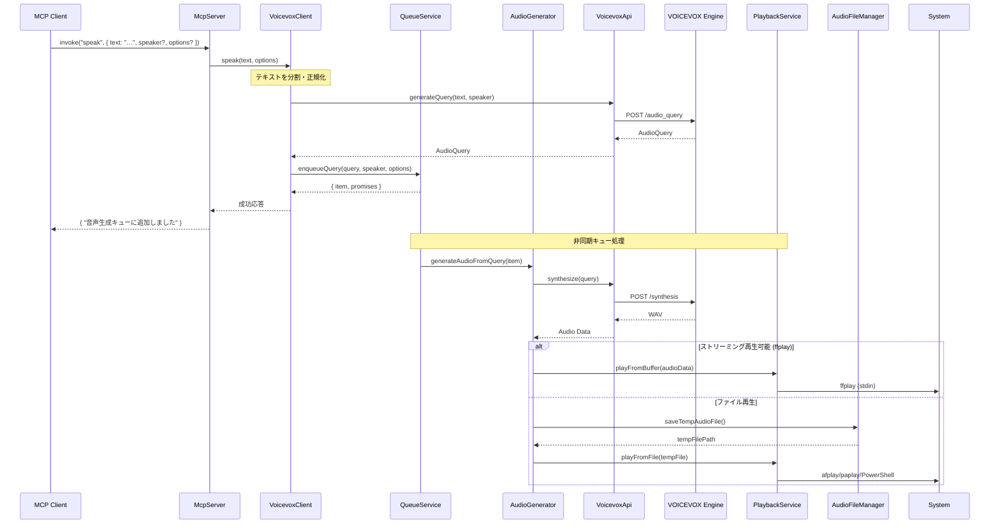
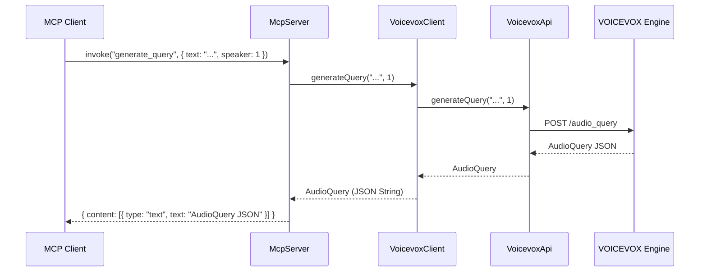
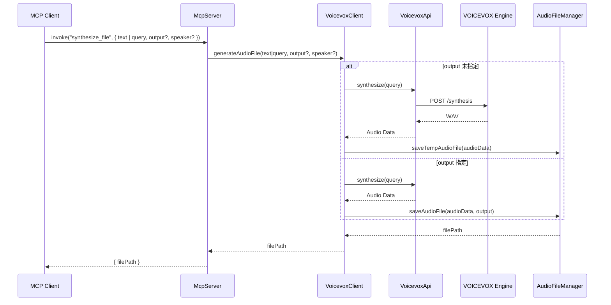
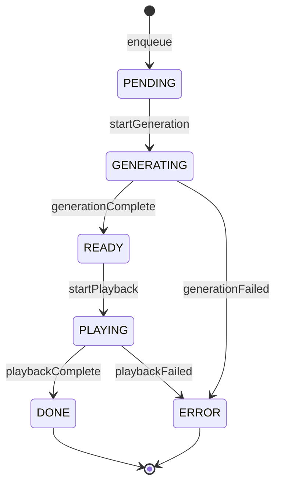
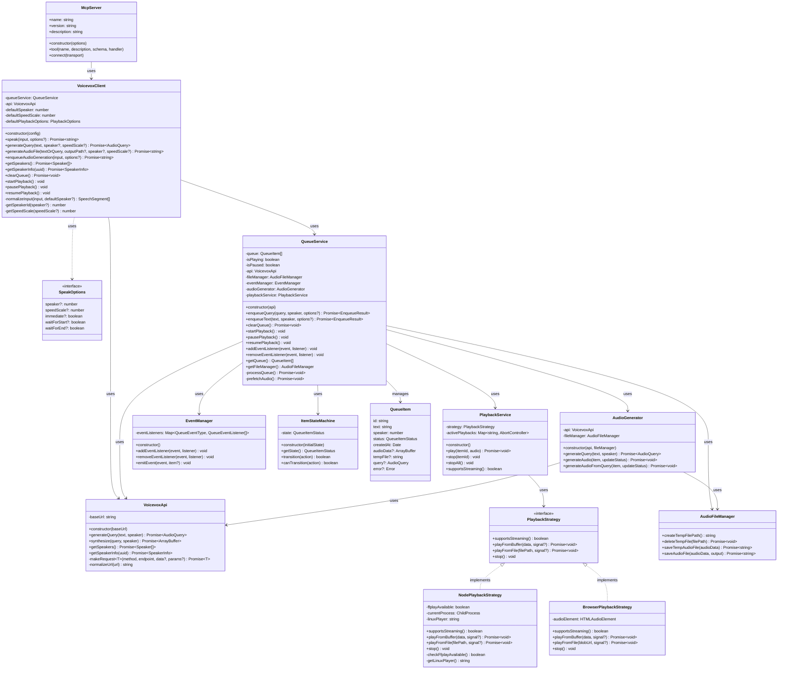

# MCP TTS Voicevox の図解

このドキュメントでは、MCP TTS Voicevox の動作シーケンスとクラス構造を図で示します。

## ツール仕様サマリ

| ツール名 | 主パラメータ | 型 | 備考 |
|----------|--------------|----|------|
| `speak` | `text` | string | 改行区切り・話者プレフィックス対応 |
|  | `speaker?` `speedScale?` | number | 省略時はデフォルト |
|  | `immediate?` `waitForStart?` `waitForEnd?` | boolean | 再生制御オプション |
| `generate_query` | `text` | string | |
| `synthesize_file` | `text?`／`query?` | string / AudioQuery | `query` 優先 |
|  | `output` | string | 未指定なら一時ファイル|
| `stop_speaker` | – | – | |
| `get_speakers` | – | – | |

## シーケンス図

### `speak` 呼び出し



### `generate_query` 呼び出し



### `synthesize_file` 呼び出し



## アーキテクチャ概要

### モジュール構成

```
packages/voicevox-client/src/
├── client.ts              # VoicevoxClient（メインファサード）
├── api.ts                 # VoicevoxApi（VOICEVOX Engine通信）
├── types.ts               # 型定義
├── error.ts               # エラーハンドリング
├── utils.ts               # ユーティリティ
│
├── state/                 # 状態管理
│   ├── item-state-machine.ts   # アイテム状態遷移
│   └── types.ts
│
├── playback/              # 再生機能
│   ├── playback-service.ts     # 統一再生サービス
│   ├── playback-strategy.ts    # プラットフォーム別戦略
│   └── types.ts
│
└── queue/                 # キュー管理
    ├── queue-service.ts        # キュー操作
    ├── audio-generator.ts      # 音声生成
    ├── file-manager.ts         # ファイル管理
    ├── event-manager.ts        # イベント管理
    └── types.ts
```

### 状態遷移図



## クラス図

主要なクラスとその関連を示します。



## 再生オプション

### PlaybackOptions インターフェース

```typescript
interface PlaybackOptions {
  /** 即座に再生開始（キューを迂回） */
  immediate?: boolean;
  /** 再生開始まで待機 */
  waitForStart?: boolean;
  /** 再生終了まで待機 */
  waitForEnd?: boolean;
}
```

### 再生モードの比較

| オプション | デフォルト | 説明 |
|-----------|----------|------|
| `immediate: true` | true | キューに追加後すぐに再生開始 |
| `immediate: false` | - | キューに追加のみ（手動再生） |
| `waitForStart: true` | false | 再生開始まで処理をブロック |
| `waitForEnd: true` | false | 再生終了まで処理をブロック |

### プラットフォーム別再生方法

| プラットフォーム | ストリーミング | ファイル再生 |
|-----------------|--------------|-------------|
| macOS | ffplay (要インストール) | afplay (標準) |
| Windows | ffplay (要インストール) | PowerShell MediaPlayer (標準) |
| Linux | ffplay | aplay / paplay / play / ffplay |
| ブラウザ | 非対応 | HTMLAudioElement |
